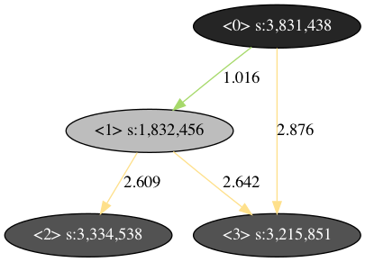

# BufferAlloc

This a toy for buffer allocation practice.

## Graph.py
This file contains the basic graph definition.
  - Node
    - idx: unique ID
    - inE: in degree edges
    - outE: out degree edges
    - size: the size of this node
  - Edge
    - idx: unique ID
    - begin: the 'from' node
    - end: the 'to' node
    - reload: the reload times (1X means no additional reload)
  - Graph
    - nodes: nodes in this graph
    - edges: edges in this graph
    
## Builder.py
This file randomly creates nodes by given the number of random objects.
Users also can use this class to craft their own graph
- Builder:
  - GetGraph(self): return current graph
  - PickRandomNode(self): return a node in graph randomly
  - PickRandomNodePair(self):	return two nodes in graph randomly
  - CreateRandomNode(self): create a random nodes that it always be end of the edge connecting it between the original graph. 
  - CreateRandomEdge(self): create a random edges, always satisfy begin.idx < end.idx. If the creation fails, creates a node randomly.
  - DumpToDot(self): serialize to .dot, and .png file

Usage:   
  `./Builder.py 100 rand.graph`
  - *100* means that the total number of random object.
  - rand.graph: optional, output graph name. The default name is "rand.graph".
  - output: rand_graph.dot, rand_graph.dot.png.     
  Example:     

  
## AnalyszerBase.py
A base class for loading graph, saving, and getting analysis result.  
  - SetName(): set analysis name
  - GetName(): get analysis name
  - SaveRes(): save the result
  - GetRes(): get the result

## BasicCommandScheduler(AnalyzerBase)
A command scheduler that sort by the indeice of nodes.
  - Input: the graph
  - Output: the command ordering
Usage:    
  `./BasicCommandScheduler.py`
  - default graph name is "rand_graph.dot"
  - output: BasicCommandScheduler.json

## LifetimeAnalyzer(AnalyzerBase)
Analyze the lifetime of node in given command ordering.
  - Input: the graph, the command ordering
  - Output: the lifetime
Usage:    
  `./LifetimeAnalyzer.py`
  - default graph name is "rand_graph.dot"
  - output: LifetimeAnalyzer.json
  
## OccupyReloadAnalyzer(AnalyzerBase)
Analyze the most valuable of nodes. (for Greedy algo)
  - Input: the graph, the lifetime
  - Output: the most valuable nodes (reload size / (lifetime * occupied_szie))
Usage:    
  `./OccupyReloadAnalyzer.py`
  - default graph name is "rand_graph.dot"
  - output: OccupyReloadAnalyzer.json

## GreedyAnalyzer(AnalyzerBase)
Using Greedy algo to select the nodes put in buffer.
  - Input: the graph, lifetime, occupied & reload, command ordering, buffer size.
  - Output: the candidate for using buffers.
Usage:    
  `./GreedyAnalyzer.py`
  - default graph name is "rand_graph.dot"
  - output: GreedyAnalyzer.json
    
   
     
For the example, given the buffer size 5MB, the Greedy algo tells node [1] will be selected.  
The available buffer along the execution will be   
    
['0.00%', '34.95%', '34.95%', '34.95%'] => reload: 9,623,715 bytes  
    
However, the answer is not optimal.  
Select node [0] is better than node [1], got reload 14,912,131 bytes.  

#### The answer format:
1. early stage: should a list of nodes.   
Example: [0, 3, 15, 17, ...]
2. mid-term: should be a list of all of nodes in graph, and with alloc/release action.   
  Example: [0: {alloc: [0], release: []}, 1: {alloc: [1], release: [0]}, ...,]
3. long-term: the address within the given buffer.  
  Example: [0: {alloc: [(0, 0x00)], release: []}, 1: {alloc: [(1, 0x40)], release: [0]}, ...,]

## Verifier.py (TODO)
The verification of the answer.
- Input: a answer (including the given buffer size)
- Output: the reduced reload size, the answer is valid or not.

